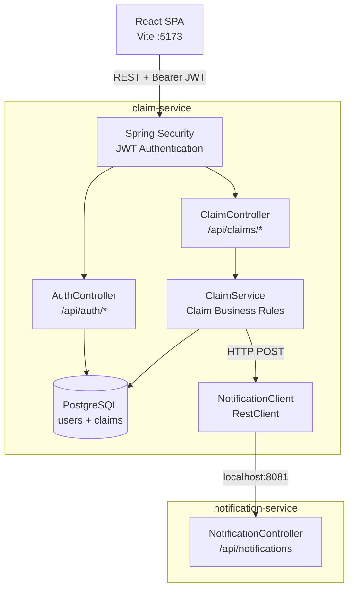

# ClaimFlow

A microservices-based insurance claims processing tool built with **Java, Spring Boot, Spring Security, PostgreSQL, and React**.


---

## 📋 Overview

ClaimFlow models an insurance claims workflow where employees can submit and track claims while managers can review and update claim statuses.

When a claim is submitted, it is automatically routed based on its amount:

- Claims **≤ $5,000** are automatically approved (Managers can still edit the status if they wish).
- Claims **> $5,000** are placed into `UNDER REVIEW`.
- Managers can approve or reject claims through the manager-only status controls.
- Every claim creation and status change sends a notification to the dedicated notification service.

The system is split into two independent Spring Boot services:

- **claim-service**: authentication, authorization, claims, business rules, and database access.
- **notification-service**: receives notification requests from claim-service and logs them.

A React frontend provides the user interface.

---

## 🏗️ Architecture



### Why two services?

ClaimFlow separates claim processing from notifications to demonstrate a basic microservices architecture.

The `claim-service` owns authentication, claims, business rules, and user data. The `notification-service` is responsible only for receiving notification requests.

The services communicate through HTTP, so the notification implementation could later be replaced with a real email, SMS, or messaging provider without changing the core claim-processing logic.

The current implementation intentionally uses **synchronous HTTP communication**. This keeps the project simple while demonstrating service-to-service communication. A production system could use asynchronous messaging to avoid making claim processing dependent on notification availability.

---

## 🔐 Security and Authentication

ClaimFlow uses Spring Security with stateless JWT authentication.

### Authentication

- Users can register and log in through `/api/auth/*`.
- Passwords are hashed using **BCrypt** before being stored.
- Successful login returns a JWT containing the user's username and role.
- JWTs expire after 24 hours.
- The API uses Bearer token authentication rather than server-side sessions.

### Authorization

ClaimFlow has two roles:

- `EMPLOYEE`
- `MANAGER`

New registrations always create an `EMPLOYEE`.

Only managers can update claim statuses. This restriction is enforced by the backend using:

```java
@PreAuthorize("hasRole('MANAGER')")
```

The frontend also hides manager controls from employees, but the backend remains the actual security boundary.

A demo manager account is automatically created when the claim-service starts:

```text
Username: manager1
Password: manager123
Role: MANAGER
```

> This is a local development/demo account and should not be used for a real production deployment.

---

## ⚙️ Claim Workflow

```text
                 Claim Created
                      │
             ┌────────┴────────┐
             │                 │
          ≤ $5,000          > $5,000
             │                 │
             ▼                 ▼
         APPROVED         UNDER_REVIEW
                               │
                         Manager Review
                           │       │
                           ▼       ▼
                       APPROVED  REJECTED
```

The automatic triage rule is implemented in `ClaimService`.

```java
if (claim.getAmount().compareTo(new BigDecimal("5000")) <= 0) {
    claim.setStatus(ClaimStatus.APPROVED);
} else {
    claim.setStatus(ClaimStatus.UNDER_REVIEW);
}
```

Managers can also manually update a claim's status.

---

## ✨ Features

- JWT-based registration and login
- BCrypt password hashing
- Role-based authorization with `EMPLOYEE` and `MANAGER`
- Automatic claim triage based on claim amount
- Manager-only claim status updates
- REST APIs for authentication and claims
- Dedicated notification microservice
- Backend-to-backend HTTP communication using Spring `RestClient`
- Jakarta Bean Validation for claim input
- Centralized exception handling with `@RestControllerAdvice`
- PostgreSQL persistence using Spring Data JPA
- JUnit 5 + Mockito unit tests for core claim business logic
- React frontend with Vite and Tailwind CSS

---

## 🛠️ Tech Stack

| Layer                       | Technology                       |
| --------------------------- | -------------------------------- |
| Language                    | Java 21                          |
| Backend                     | Spring Boot 4                    |
| Security                    | Spring Security, JWT, BCrypt     |
| Persistence                 | Spring Data JPA, Hibernate       |
| Database                    | PostgreSQL 16                    |
| Database Runtime            | Docker Desktop                   |
| Validation                  | Jakarta Bean Validation          |
| Inter-service communication | Spring `RestClient`              |
| Frontend                    | React 19, Vite 8, Tailwind CSS 4 |
| Testing                     | JUnit 5, Mockito                 |
| Build                       | Maven                            |

> Docker is used only to run the PostgreSQL database locally. The ClaimFlow application services themselves are not containerized.

---

## 📁 Repository Structure

```text
claimflow/
├── claim-service/                    # Main backend service
│   ├── src/
│   │   ├── main/
│   │   │   ├── java/com/Claimflow/claim_service/
│   │   │   │   ├── config/          # CORS, password encoder, initialization
│   │   │   │   ├── controller/      # REST API endpoints
│   │   │   │   ├── dto/              # API request/response objects
│   │   │   │   ├── exception/        # Custom exceptions and error handling
│   │   │   │   ├── model/            # JPA entities and enums
│   │   │   │   ├── repository/       # Database access through Spring Data JPA
│   │   │   │   ├── security/         # JWT authentication and authorization
│   │   │   │   └── service/          # Business logic
│   │   │   └── resources/             # Application configuration
│   │   └── test/                      # Unit tests
│   └── pom.xml                        # Maven dependencies and build configuration
│
├── notification-service/              # Notification microservice
│   ├── src/
│   │   └── main/
│   │       ├── java/com/claimflow/notification_service/
│   │       │   ├── controller/        # Notification REST endpoint
│   │       │   └── dto/               # Notification request object
│   │       └── resources/             # Application configuration
│   └── pom.xml                        # Maven dependencies and build configuration
│
└── claimflow-frontend/                # React frontend
    ├── public/                        # Static assets, including favicon
    ├── src/
    │   ├── App.jsx                    # Main React application and UI logic
    │   ├── main.jsx                   # React application entry point
    │   └── index.css                  # Global styles / Tailwind import
    ├── index.html                     # HTML entry point and page metadata
    ├── package.json                   # Frontend dependencies and scripts
    └── vite.config.js                 # Vite configuration
```

---

# 🚀 Getting Started

These instructions assume a fresh clone of the repository on **Windows**.

ClaimFlow uses Docker Desktop only for its local PostgreSQL database. The Java services and React frontend run directly on the host machine.

## 1. Install the prerequisites

Install:

- **JDK 21**
- **Node.js + npm**
- **Docker Desktop**

Maven does **not** need to be installed separately because both Spring Boot services include the Maven Wrapper.

### Verify Java

Open PowerShell and run:

```powershell
java -version
```

You should see Java 21.

### Verify Node.js and npm

```powershell
node -v
npm -v
```

### Verify Docker

```powershell
docker --version
```

Make sure **Docker Desktop is running** before continuing.

---

## 2. Clone the repository

Open PowerShell and run:

```powershell
git clone https://github.com/elbarbaa/claimflow.git
cd claimflow
```

---

## 3. Start PostgreSQL

ClaimFlow expects PostgreSQL with these settings:

```text
Host:     localhost
Port:     5433
Database: claimflow
Username: claimflow
Password: claimflow
```

Docker creates and runs the PostgreSQL database environment, including the `claimflow` database. Spring Boot connects to that database, while Hibernate/JPA manages the tables and schema based on the Java entities.

### First-time setup

If the `claimflow-db` container does not exist yet, run the following command from the project root:

```powershell
docker run --name claimflow-db `
  -e POSTGRES_DB=claimflow `
  -e POSTGRES_USER=claimflow `
  -e POSTGRES_PASSWORD=claimflow `
  -p 5433:5432 `
  -v claimflow-data:/var/lib/postgresql/data `
  -d postgres:16
```

This creates and starts a PostgreSQL 16 container named `claimflow-db`.

The database data is stored in the Docker volume `claimflow-data`.

### If the container already exists

Do **not** run `docker run` again if the `claimflow-db` container already exists. Running `docker run` again attempts to create a new container and may produce a container-name conflict.

Check the container status:

```powershell
docker ps -a
```

If `claimflow-db` exists but is stopped, start it with:

```powershell
docker start claimflow-db
```

If `claimflow-db` is already running, no additional command is needed.

You can also check whether it is currently running with:

```powershell
docker ps
```

You should see `claimflow-db` listed with port `5433` mapped to PostgreSQL's internal port `5432`.

### Stop and restart PostgreSQL

To stop PostgreSQL when you are finished working:

```powershell
docker stop claimflow-db
```

To start the same PostgreSQL container again later:

```powershell
docker start claimflow-db
```

Stopping the container does not delete the database data. The data remains stored in the Docker volume `claimflow-data`.

You do **not** need to manually create the database, user, tables, or run migrations.

Spring Boot automatically creates or updates the required tables when the claim-service starts. Hibernate/JPA manages the schema based on the application's Java entities.

---

## 4. Start the notification-service

Open a **new PowerShell window**.

From the project root:

```powershell
cd claimflow\notification-service
.\mvnw.cmd spring-boot:run
```

The notification service runs on:

```text
http://localhost:8081
```

Keep this terminal running.

The service currently simulates notifications by logging them to the console.

For example:

```text
Notification: Claim 1 is now APPROVED
```

---

## 5. Start the claim-service

Open another **new PowerShell window**.

From the project root:

```powershell
cd claimflow\claim-service
.\mvnw.cmd spring-boot:run
```

The claim service runs on:

```text
http://localhost:8080
```

On startup it will:

1. Connect to PostgreSQL.
2. Create or update the required database tables through Hibernate/JPA.
3. Create the demo manager account if it does not already exist.

Keep this terminal running.

---

## 6. Start the frontend

Open another **new PowerShell window**.

From the project root:

```powershell
cd claimflow\claimflow-frontend
npm install
npm run dev
```

Vite will start the frontend at:

```text
http://localhost:5173
```

Open that address in your browser.

---

# ▶️ Try It Out

### Manager account

Log in with:

```text
Username: manager1
Password: manager123
```

The manager can view claims and use **Edit Status** to approve or reject claims.

### Employee account

From the login screen, register a new account.

New registrations automatically receive:

```text
Role: EMPLOYEE
```

Employees can submit and view claims but cannot update claim statuses.

---

## Test the Automatic Claim Triage

Submit a claim for:

```text
$5,000
```

It will automatically become:

```text
APPROVED
```

Submit another claim for an amount greater than:

```text
$5,000
```

It will automatically become:

```text
UNDER_REVIEW
```

Then log in as `manager1` and use **Edit Status** to approve or reject the claim.

When a claim is created or its status changes, check the **notification-service** terminal for the notification log.

---

# 🔌 API Reference

## claim-service

Runs on:

```text
http://localhost:8080
```

| Method | Endpoint                  | Authentication         | Description                    |
| ------ | ------------------------- | ---------------------- | ------------------------------ |
| `POST` | `/api/auth/register`      | Public                 | Register a new employee        |
| `POST` | `/api/auth/login`         | Public                 | Authenticate and receive a JWT |
| `POST` | `/api/claims`             | Bearer token           | Submit a claim                 |
| `GET`  | `/api/claims`             | Bearer token           | Get all claims                 |
| `GET`  | `/api/claims/{id}`        | Bearer token           | Get a specific claim           |
| `PUT`  | `/api/claims/{id}/status` | Bearer token + MANAGER | Update claim status            |

## notification-service

Runs on:

```text
http://localhost:8081
```

| Method | Endpoint             | Description                    |
| ------ | -------------------- | ------------------------------ |
| `POST` | `/api/notifications` | Receive and log a notification |

---

# 🧪 Testing

The claim-service contains JUnit 5 + Mockito unit tests for the core claim-processing logic.

Tests cover:

- Claims of `$5,000` or less are automatically approved.
- Claims above `$5,000` are placed into `UNDER_REVIEW`.
- Requests for non-existent claims throw `ClaimNotFoundException`.

Run the tests:

```powershell
cd claim-service
.\mvnw.cmd test
```

A successful run should finish with:

```text
BUILD SUCCESS
```


---

# ⚠️ Current Limitations

ClaimFlow is intentionally a local development/portfolio project rather than a production deployment.

### Notification service

The notification service currently logs notifications to the console instead of sending real email, SMS, or push notifications.

### Synchronous service communication

For simplicity, the claim-service calls the notification-service synchronously using HTTP.

This means a notification-service failure can affect the claim operation that triggered the notification.

### JWT secret

Once again, since this is not a production environment, The JWT signing secret is currently hardcoded in `JwtService` for local development.

Production deployments should provide the secret through secure environment or secret-management configuration.

### Local service configuration

The services are currently configured for local development:

```text
claim-service:        localhost:8080
notification-service: localhost:8081
frontend:             localhost:5173
PostgreSQL:           localhost:5433
```

There is currently no API gateway or service discovery layer.

---

# 🔮 Future Improvements

Potential next steps include:

- Replace synchronous notifications with asynchronous messaging such as RabbitMQ or Kafka.
- Move JWT and database credentials into secure environment configuration.
- Add integration tests using a real PostgreSQL instance.
- Add an API gateway for service routing.
- Connect the notification service to a real email/SMS provider.
- Add claim attachments and document handling.
- Add filtering to the claims dashboard.
- Add claim status history and auditing.
- Add production deployment configuration.

---


